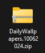
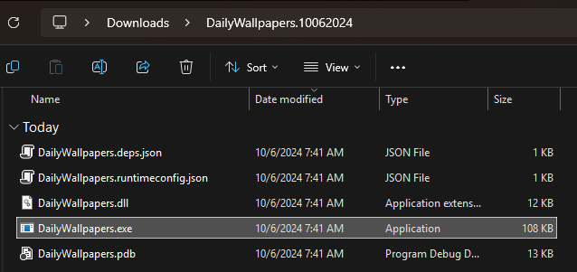
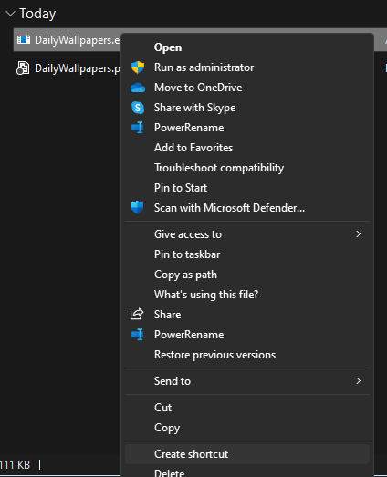
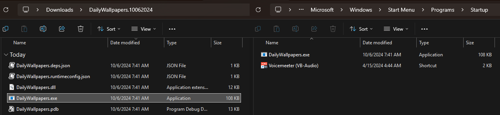

# DailyWallpapers 

Console application that checks Bing's api for new daily images, and sets them as desktop wallpapers.

## Table of Contents

1. [How To Install](#how-to-install)
2. [Adding to Startup](#adding-to-startup)
3. [Info](#info)

### How To Install

Simple and easy installation. Head over to <a href="https://github.com/aisyshk/DailyWallpapers-Rewrite/releases/latest">the latest release</a> and download the `DailyWallpapers.10062024.zip` file.

Once downloaded, unzip `DailyWallpapers.10062024.zip` open it.

 

### Adding to Startup

If you'd like, move the `DailyWallpapers` folder to your `C:/` drive or your desktop. Open the folder with the `.exe` and create a shortcut to the `.exe`.

To add it to startup, press `Windows Key` + `R`, then type `shell:startup`. Drag and drop the shortcut you made into the startup folder.

And that's it! You've downloaded and set the app to run on startup

### Info 

⚠️ On the offchance that the Windows Smartscreen flags the file, due to it being unsigned, allow it to execute.
